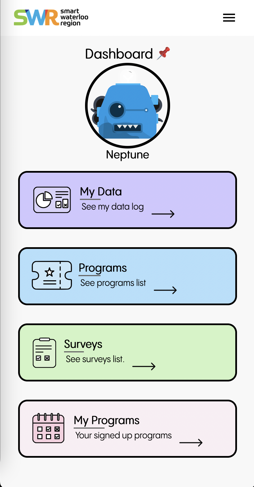
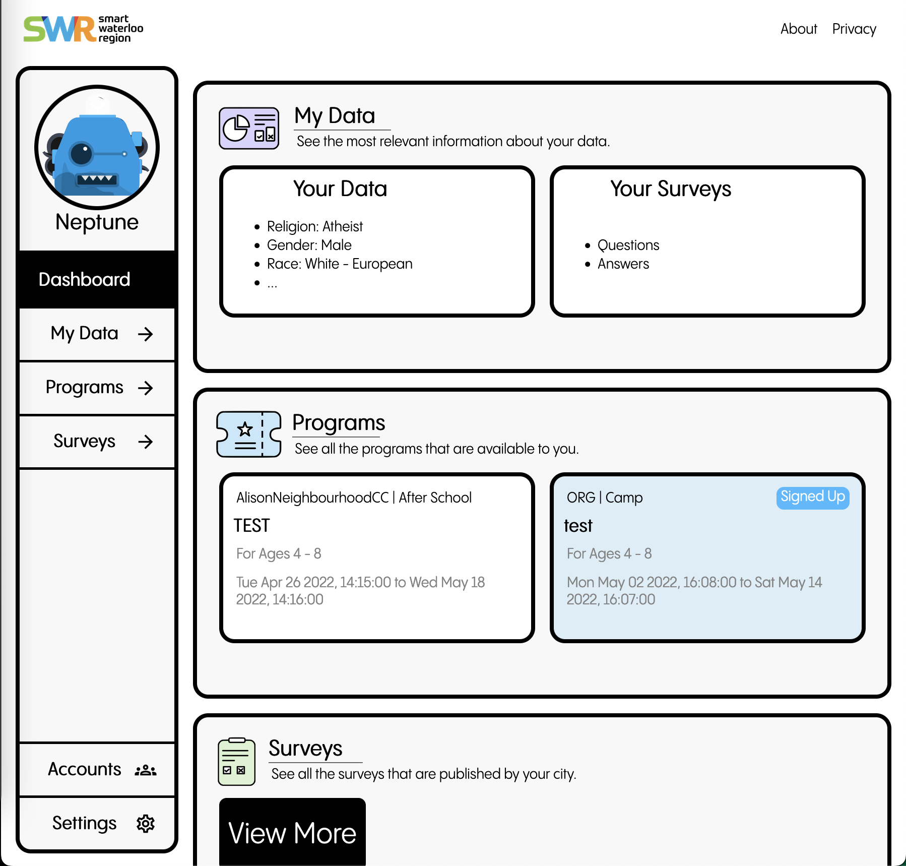
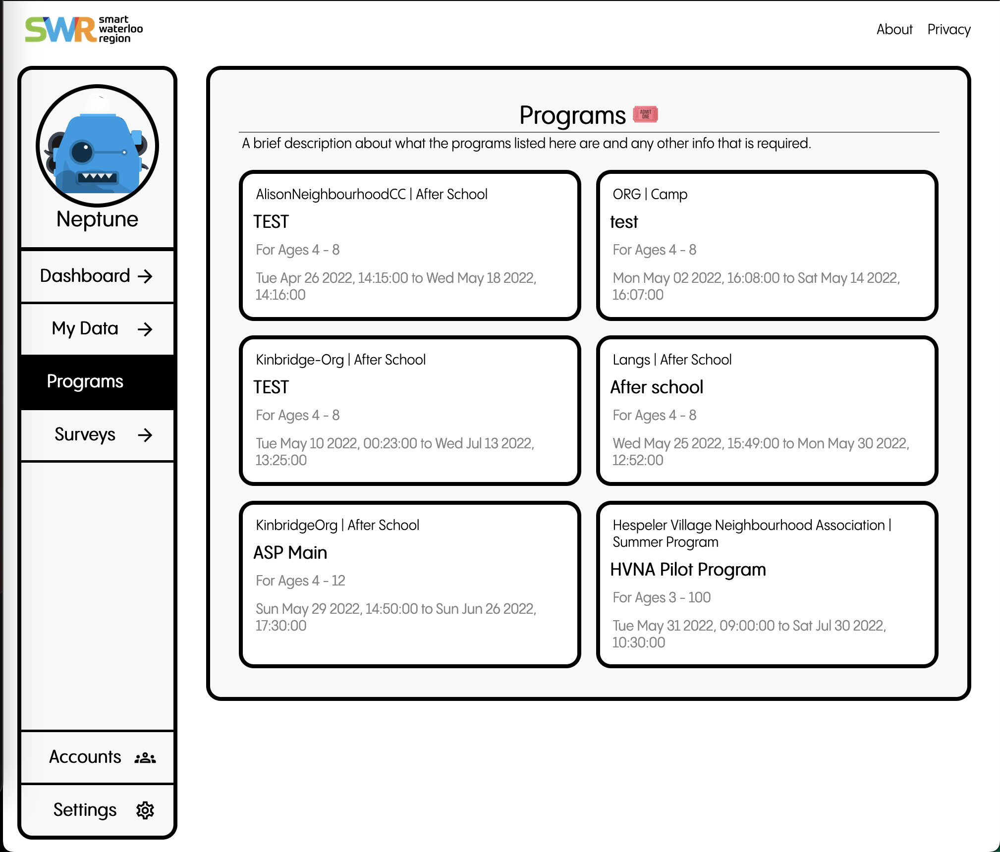
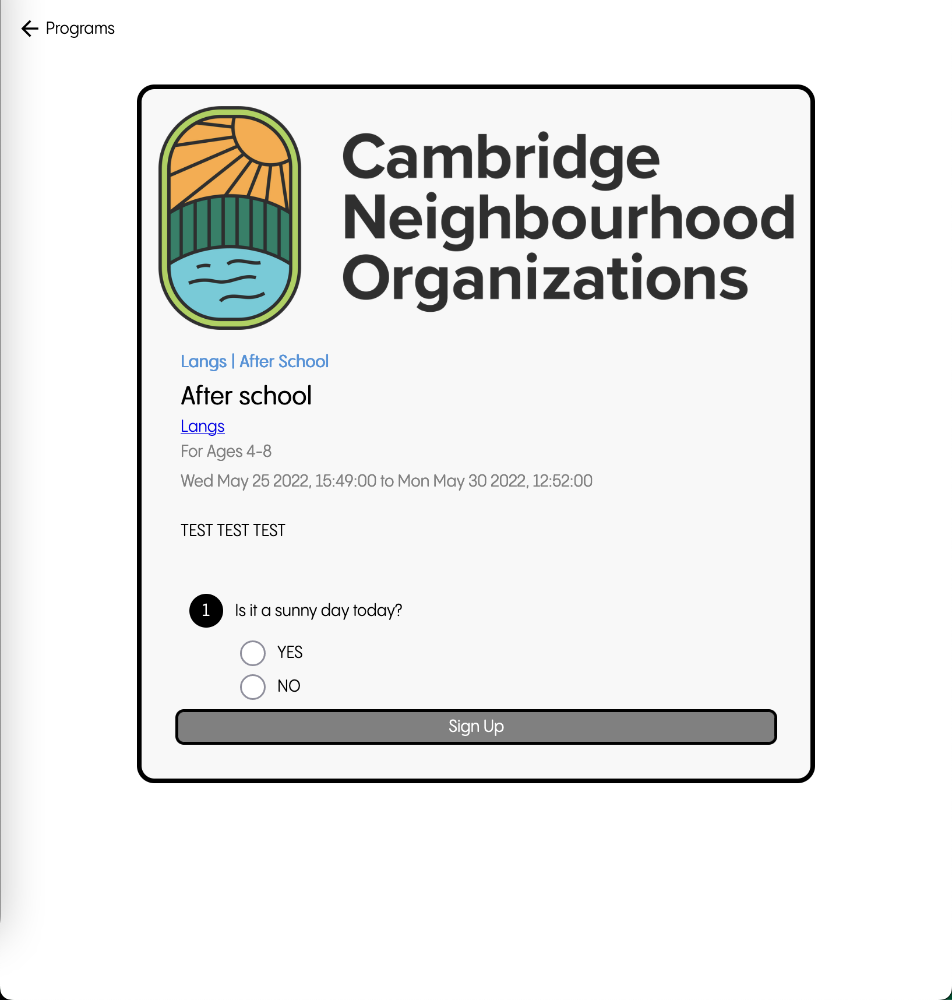
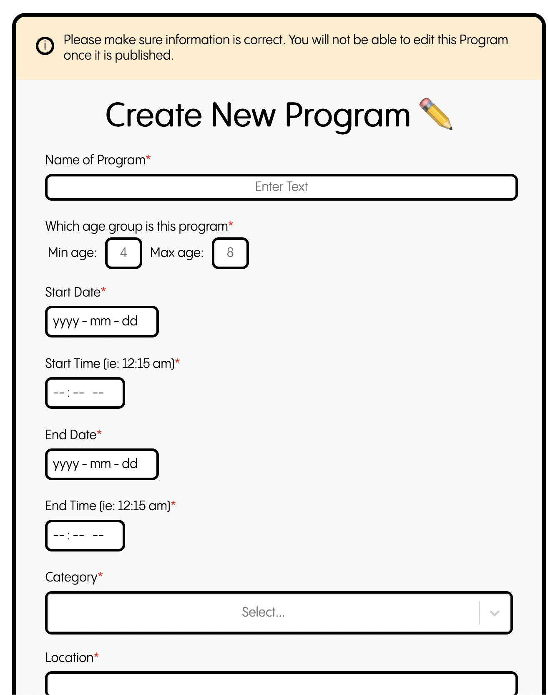
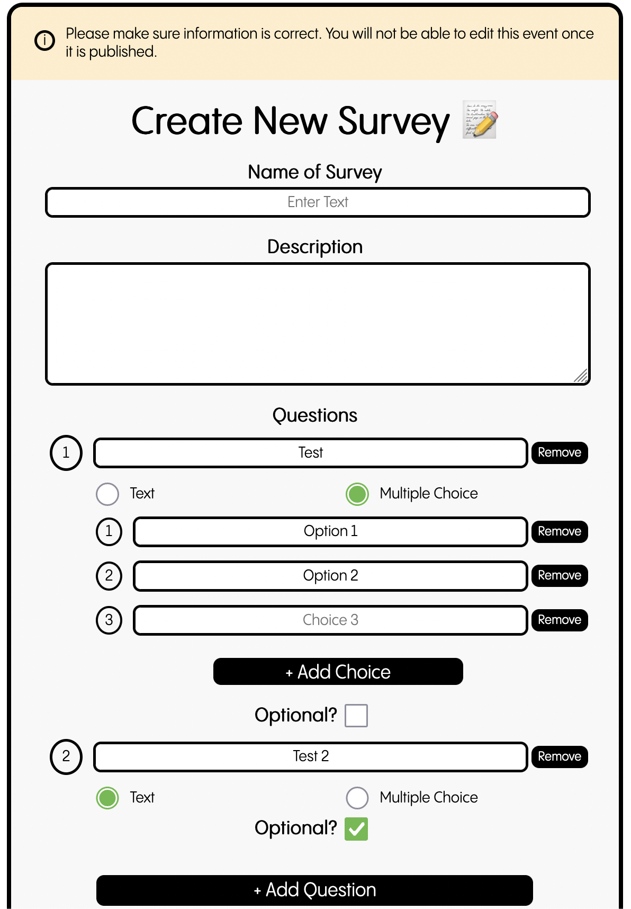
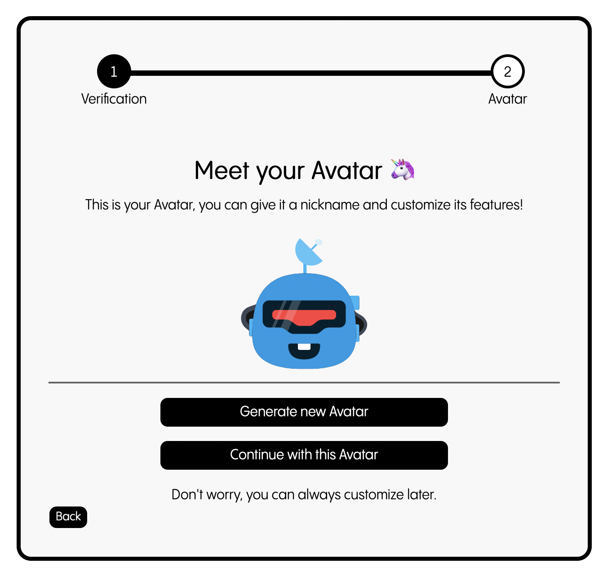
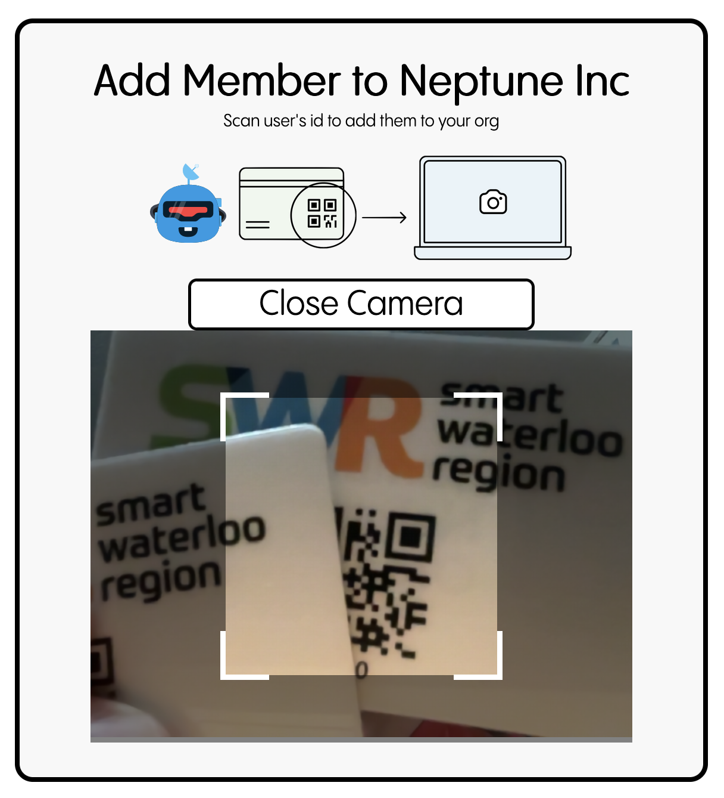

# SmartWaterloo

## Code for the Smart Waterloo Region Pilot

## Tech Stack:

 

<table>
<tr>
<td> </td>
<td> </td>
<td> </td>
<td> </td>
<td> </td>
<td> </td>
<td> </td>
<td> </td>
</tr>
<tr>
<td colspan='2'>

Mobile Dashboard

</td>
<td colspan='6'>

Desktop Dashboard

</td>
</tr>
<tr>
<td colspan='4'>

All Programs

</td>
<td colspan='4'>

View Program

</td>
</tr>
<tr>
<td colspan='4'>

Create New Program

</td>
<td colspan='4'>

Create New Survey

</td>
</tr>
<tr>
<td colspan='4'>

Select Avatar

</td>
<td colspan='4'>

Scan QR to add member

</td>
</tr>
</table>
